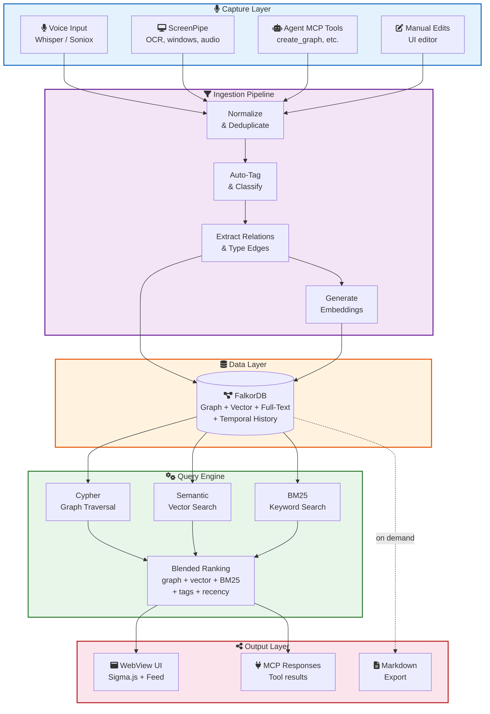
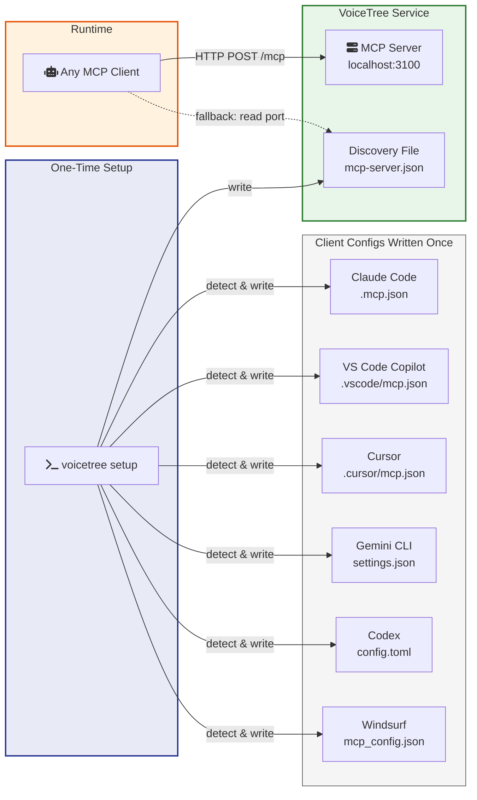
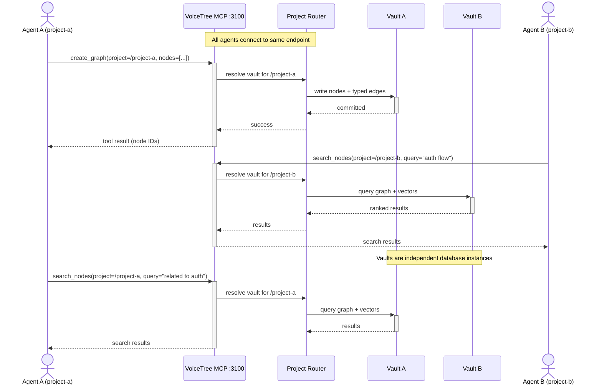
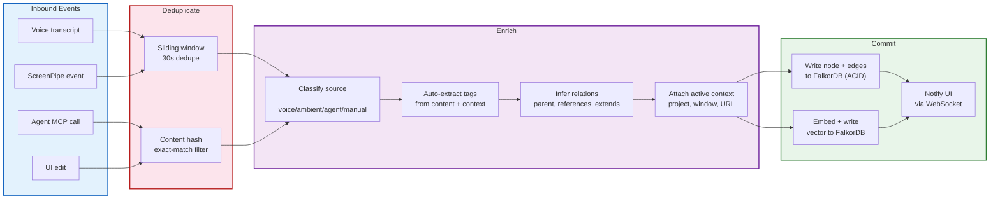
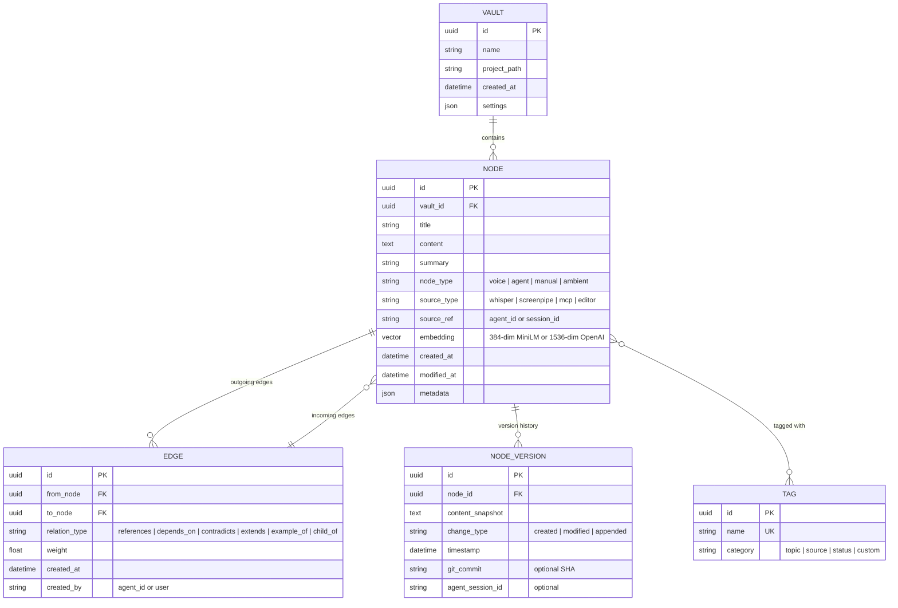
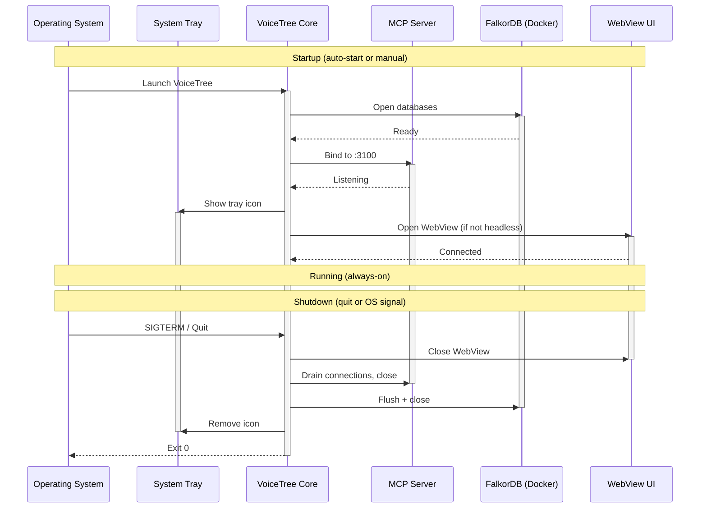

# VoiceTree v2 — Architecture Detail

> Implementation-level diagrams, data models, and component specifications.
> For the high-level vision and decisions, see `NORTH-STAR.md`.
> For phased implementation plan, see `v2-plan/README.md`.

---

## Data Flow — Capture to Output



---

## MCP Discovery — One-Time Setup



VoiceTree writes to client configs **once** during setup, not on every launch. The port is fixed. No file injection into project directories. The discovery file is a fallback for clients that aren't pre-configured.

---

## Multi-Project Routing



Agents declare which project they're working in. VoiceTree routes to the right vault. Multiple projects active simultaneously as independent database instances.

---

## Ingestion Pipeline Detail



---

## Graph Data Model



### FalkorDB Cypher Schema

The data model above maps to FalkorDB indexes deployed on startup:

```cypher
-- Unique constraint on node ID
CREATE INDEX FOR (n:Node) ON (n.id)

-- Property indexes for fast lookups
CREATE INDEX FOR (n:Node) ON (n.title)
CREATE INDEX FOR (n:Node) ON (n.node_type)
CREATE INDEX FOR (n:Node) ON (n.created_at)
CREATE INDEX FOR (n:Node) ON (n.vault_id)

-- Full-text index for BM25 search
CALL db.idx.fulltext.createNodeIndex('Node', 'title', 'content', 'summary')

-- Vector index for semantic search (384 dims for MiniLM-L6-v2)
CALL db.idx.vector.createNodeIndex('Node', 'embedding', 384, 'cosine')
```

All vector, keyword, and graph queries run against this single FalkorDB instance.
See `v2-plan/PHASE-0-FOUNDATION.md` for full schema deployment code.

---

## Lifecycle — Startup and Shutdown



---

## Component Responsibilities

### Core Service (Node.js / Electron main process)

- **MCP Server**: Fixed-port StreamableHTTP server exposing tools to agents
  - `create_graph` — batch node/edge creation with DAG support
  - `search_nodes` — blended retrieval (graph + vector + tags + time)
  - `spawn_agent` — terminal spawning with worktree isolation
  - `wait_for_agents` — async agent coordination
  - `get_graph` — graph state queries (neighbors, paths, subgraphs)
  - `set_project` — declare active project context
- **Ingestion Pipeline**: Normalize, deduplicate, auto-tag, extract relations, write to graph DB
- **Query Engine**: Cypher graph queries + vector search + blended ranking
- **Project Router**: Map project paths to vaults, manage multi-project state
- **Lifecycle Manager**: System tray, auto-start, graceful shutdown, port management

### Data Layer (FalkorDB — graph + vector + full-text unified)

- **FalkorDB (Redis-backed)**: Single authoritative store for nodes, typed edges, tags, temporal history, vector embeddings, and full-text indexes
- **Docker container**: Managed by Electron — auto-start on launch, graceful shutdown, persistent volume for data
- **Markdown Export**: On-demand export of vault to human-readable `.md` files with frontmatter

### UI (React in Electron WebView)

- **Graph View**: Sigma.js WebGL renderer with semantic zoom, filtering, focus mode
- **Feed View**: Chronological/relevance-sorted node feed (primary navigation)
- **Search**: Full-text + semantic + graph-aware search
- **Node Editor**: WYSIWYG-ish markdown editor (study Heptabase's interaction model)
- **Terminal Panel**: Embedded terminals for agent spawning
- **Filter Panel**: Filter by type, tag, relation, time, agent, project

### External Integrations (all optional, all pluggable)

- **Voice transcription**: Separate service, consumed via stream
- **ScreenPipe**: Ambient capture via REST API (OCR, windows, audio)
- **MCP Clients**: Any tool that speaks MCP connects to the fixed-port server
- **Git**: Optional commit correlation for temporal graph features
