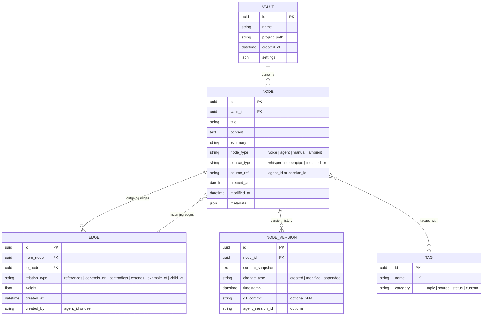

# VoiceTree v2 — North Star Architecture

> A from-scratch reimagining of VoiceTree as a persistent, always-on knowledge service
> with a proper graph database, daemon architecture, and universal MCP discovery.

---

## Requirements

What must this system do?

- **Capture voice and text input** and convert it into structured, linked knowledge nodes in real time
- **Visualize knowledge as an interactive graph** that remains performant at 10,000+ nodes
- **Serve as a multi-agent control plane** — any AI coding agent (Claude, Copilot, Cursor, Gemini, Codex, Windsurf, Cline) can connect via MCP and create/query/traverse the graph
- **Run always-on** as a background service — no manual project scoping, no "open a folder" step
- **Ingest ambient context** — active window, screen content (OCR), browser tabs, editor state — and route it into the graph with source attribution
- **Support multiple projects simultaneously** — agents working in different repos all connect to the same service, each routed to the right vault/context
- **Store knowledge in a real graph database** with typed edges, ACID transactions, graph traversal algorithms, and indexed queries
- **Export to human-readable markdown** — the graph DB is the runtime store, markdown is the export format
- **Be discoverable by any MCP client** without per-project config file injection
- **Be open source and local-first** — all data stays on the user's machine

---

## Goals

What are we optimizing for?

- **Zero-config agent integration** — any MCP client finds VoiceTree automatically
- **Ambient, effortless capture** — like Granola for meetings, but for all knowledge work
- **Graph-native data model** — typed edges, tags, temporal history, graph algorithms as first-class features
- **Scale** — comfortable at 1,000 nodes, usable at 10,000+, architecturally capable of 100,000+
- **Developer-first** — agents are the primary users, humans navigate via feed/search/graph
- **Single binary / single service** — no Python subprocess, no Redis dependency, no Docker

---

## Non-Goals (Explicitly Out of Scope)

- Cloud sync or collaboration (local-first only, for now)
- Mobile app
- Full Obsidian plugin compatibility
- Real-time collaboration between multiple humans

---

## Decisions

### Runtime: Tauri (Rust + WebView) over Electron

**Why:**
- Single binary distribution (~10MB vs ~150MB Electron)
- Rust backend = no Python subprocess, no Node.js main process
- Native system tray / daemon mode built-in
- IPC is faster (Rust ↔ WebView vs Node ↔ Chromium)
- Lower memory footprint for always-on service

**Trade-off:** Smaller ecosystem than Electron, steeper learning curve for Rust

### Graph Database: Kuzu (embedded) as primary store

**Why:**
- Embeddable — runs in-process like SQLite, no server to manage
- Cypher query language — industry standard for graph queries
- Designed for analytical graph workloads (traversals, aggregations)
- Typed edges, node properties, indexes — all native
- Perfect weight class for a desktop app

**Trade-off:** Younger project than Neo4j, smaller community. But we don't need enterprise features.

### Vector Search: Keep ChromaDB as sidecar (or evaluate Kuzu's future vector support)

**Why:**
- ChromaDB is proven for embedding-based semantic search
- Kuzu doesn't have native vector indexes yet
- Keep them as separate concerns: graph DB for structure, vector DB for semantics
- Evaluate SurrealDB later if we want to collapse both into one

### Graph Rendering: Sigma.js (WebGL)

**Why:**
- Purpose-built for large graph visualization
- WebGL rendering — 10,000+ nodes at 60fps
- Semantic zoom, level-of-detail built in
- Active development, good API

**Trade-off:** Less flexible than Cytoscape.js for custom shapes, but vastly better at scale

### Voice Transcription: Soniox (keep existing) or Whisper (local)

**Why Soniox:** Real-time streaming, good accuracy, already integrated in VoiceTree v1
**Why Whisper:** Local-first, no API dependency, good enough for most use cases
**Decision:** Support both via provider interface. Default to Whisper for local-first, Soniox as opt-in for quality.

### Ambient Capture: ScreenPipe integration

**Why:**
- Open source, already has OCR, active window tracking, audio transcription
- REST API at localhost:3030
- Handles the hard part (screen capture, OCR) so we don't have to
- Active community

### MCP Transport: StreamableHTTP on fixed port

**Why:**
- StreamableHTTP is the current MCP standard (v2025-03-26)
- Fixed port (default 3100, configurable via `VOICETREE_PORT`) — no random port hunting
- Global discovery via well-known file at OS config dir
- One-time `voicetree setup` configures all detected MCP clients

### Frontend Framework: React (keep) with Tailwind

**Why:** React is fine. The UI is not the hard part. Keep what works.

---

## Architecture Overview

---

## Data Flow — Capture to Output

---

## MCP Discovery — One-Time Setup

**Key point:** VoiceTree writes to client configs **once** during setup, not on every launch. The port is fixed. No file injection into project directories. Any MCP client anywhere on the machine can connect. The discovery file is a fallback for clients that aren't pre-configured.

---

## Multi-Project Routing

**Key point:** Agents declare which project they're working in. VoiceTree routes to the right vault. Multiple projects are active simultaneously as independent Kuzu database instances. No folder watching. No config injection.

---

## Ingestion Pipeline Detail

---

## Graph Data Model

---

## Lifecycle — Startup and Shutdown

---

## Component Responsibilities

### Core Service (Rust / Tauri backend)

- **MCP Server**: Fixed-port StreamableHTTP server exposing tools to agents
  - `create_graph` — batch node/edge creation with DAG support
  - `search_nodes` — blended retrieval (graph + vector + tags + time)
  - `spawn_agent` — terminal spawning with worktree isolation
  - `wait_for_agents` — async agent coordination
  - `get_graph` — graph state queries (neighbors, paths, subgraphs)
  - `set_project` — declare active project context
- **Ingestion Pipeline**: Normalize, deduplicate, auto-tag, extract relations, write to graph DB
- **Query Engine**: Cypher graph queries + vector search + blended ranking
- **Voice Transcriber**: Whisper (local) or Soniox (cloud) via provider interface
- **Project Router**: Map project paths to vaults, manage multi-project state
- **Lifecycle Manager**: System tray, auto-start, graceful shutdown, port management

### Data Layer

- **Kuzu Graph DB**: Authoritative store for nodes, typed edges, tags, temporal history
- **ChromaDB**: Vector embeddings for semantic search (sidecar process or embedded)
- **Markdown Export**: On-demand export of vault to human-readable `.md` files with frontmatter

### UI (React in Tauri WebView)

- **Graph View**: Sigma.js WebGL renderer with semantic zoom, filtering, focus mode
- **Feed View**: Chronological/relevance-sorted node feed (primary navigation)
- **Search**: Full-text + semantic + graph-aware search
- **Node Editor**: WYSIWYG-ish markdown editor (study Heptabase's interaction model)
- **Terminal Panel**: Embedded terminals for agent spawning
- **Filter Panel**: Filter by type, tag, relation, time, agent, project

### External Integrations

- **ScreenPipe**: Ambient capture via REST API (OCR, windows, audio)
- **MCP Clients**: Any tool that speaks MCP connects to the fixed-port server
- **Git**: Optional commit correlation for temporal graph features

---

## What We Take From VoiceTree v1

Ideas and patterns worth preserving:

- **MCP tool API design** — `create_graph`, `spawn_agent`, `wait_for_agents` are well-designed tools
- **Voice → structured nodes pipeline** — the concept works, even if the implementation needs replacing
- **Progress graph for agents** — unique paradigm, keep it
- **Pure/shell architecture split** — good principle, apply it in Rust (pure functions vs I/O boundary)
- **Auto-positioning algorithms** — graph layout heuristics from `createGraphTool.ts`
- **Worktree management** — git worktree isolation for agent work

What we explicitly leave behind:

- Markdown files as runtime source of truth
- Per-project config file injection
- Random port binding
- Python subprocess for backend
- Chokidar file watching as primary ingestion
- 300-node hard cap
- Canvas-based Cytoscape rendering
- Fire-and-forget async patterns (`void startMcpServer()`)

---

## Open Questions

- **Kuzu vs SurrealDB**: SurrealDB offers graph + document + vector in one DB. Worth the maturity risk?
- **Tauri vs Electron**: Tauri is the better architecture, but Electron has the bigger ecosystem. Is the team comfortable with Rust?
- **Whisper model size**: Which Whisper model balances accuracy vs resource usage for always-on?
- **ScreenPipe dependency**: Hard dependency or optional integration? What if ScreenPipe isn't running?
- **Obsidian compatibility**: Should markdown export be Obsidian-compatible (frontmatter + wikilinks)?
- **License**: MIT? AGPL? Affects community adoption.
