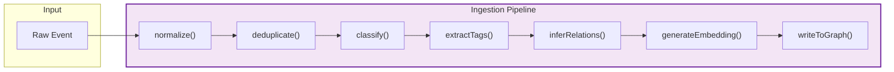

# Phase 1 — Core Services: Ingestion, Query, MCP Tools

> **Duration**: Weeks 5–8  
> **Effort**: ~160 hours  
> **Depends on**: Phase 0 (FalkorDB running, schema deployed, MCP server up)  
> **Enables**: Phase 2 (UI needs query engine), Phase 3 (ambient capture needs ingestion pipeline)

---

## Goals

1. **Unified ingestion pipeline** — all input sources (voice, text, agent, ambient) flow through one normalize → dedupe → tag → relate → embed → write pipeline
2. **Blended query engine** — Cypher graph traversal + vector similarity + BM25 full-text, merged into a single ranked result set
3. **Project router** — agents declare their project, VoiceTree routes to the correct vault/graph
4. **MCP tool implementations** — all v1 tools (`create_graph`, `search_nodes`, `spawn_agent`, `wait_for_agents`) working against FalkorDB

---

## Prerequisites

- Phase 0 complete: FalkorDB running, schema deployed, client connected, MCP server listening
- Embedding model available (MiniLM-L6-v2 for local, or OpenAI API for cloud)

---

## Task Breakdown

### 1.1 — Embedding Service (Days 1–3)

**Goal**: Generate vector embeddings for node content. Pluggable — local (MiniLM) or cloud (OpenAI).

```typescript
// src/pure/types/embedding.ts

export interface EmbeddingProvider {
  readonly name: string;
  readonly dimensions: number;
  embed(text: string): Promise<number[]>;
  embedBatch(texts: string[]): Promise<number[][]>;
}
```

```typescript
// src/shell/edge/main/embedding/local-provider.ts

import { pipeline, type FeatureExtractionPipeline } from '@xenova/transformers';
import type { EmbeddingProvider } from '../../pure/types/embedding';

let model: FeatureExtractionPipeline | null = null;

export function createLocalEmbeddingProvider(): EmbeddingProvider {
  return {
    name: 'all-MiniLM-L6-v2',
    dimensions: 384,

    async embed(text: string): Promise<number[]> {
      if (!model) {
        model = await pipeline('feature-extraction', 'Xenova/all-MiniLM-L6-v2');
      }
      const output = await model(text, { pooling: 'mean', normalize: true });
      return Array.from(output.data as Float32Array);
    },

    async embedBatch(texts: string[]): Promise<number[][]> {
      return Promise.all(texts.map(t => this.embed(t)));
    },
  };
}
```

```typescript
// src/shell/edge/main/embedding/openai-provider.ts

import type { EmbeddingProvider } from '../../pure/types/embedding';

export function createOpenAIEmbeddingProvider(apiKey: string): EmbeddingProvider {
  return {
    name: 'text-embedding-3-small',
    dimensions: 1536,

    async embed(text: string): Promise<number[]> {
      const response = await fetch('https://api.openai.com/v1/embeddings', {
        method: 'POST',
        headers: {
          'Authorization': `Bearer ${apiKey}`,
          'Content-Type': 'application/json',
        },
        body: JSON.stringify({
          model: 'text-embedding-3-small',
          input: text,
        }),
      });
      const data = await response.json() as { data: Array<{ embedding: number[] }> };
      return data.data[0]!.embedding;
    },

    async embedBatch(texts: string[]): Promise<number[][]> {
      const response = await fetch('https://api.openai.com/v1/embeddings', {
        method: 'POST',
        headers: {
          'Authorization': `Bearer ${apiKey}`,
          'Content-Type': 'application/json',
        },
        body: JSON.stringify({
          model: 'text-embedding-3-small',
          input: texts,
        }),
      });
      const data = await response.json() as {
        data: Array<{ embedding: number[]; index: number }>
      };
      return data.data
        .sort((a, b) => a.index - b.index)
        .map(d => d.embedding);
    },
  };
}
```

**Effort**: 2 days  
**Risk**: Local model download is ~100MB — cache in app data directory  
**Test**: Embed "hello world", verify dimensions match, verify cosine similarity between related texts > 0.7

---

### 1.2 — Ingestion Pipeline (Days 2–8)

**Goal**: A pure pipeline that normalizes, deduplicates, enriches, and writes any input into FalkorDB.

#### Pipeline Architecture



#### Type Definitions

```typescript
// src/pure/types/ingestion.ts

import type { NodeType, SourceType, RelationType } from './graph';

/** Raw ingestion event from any source */
export interface IngestionEvent {
  readonly source: SourceType;
  readonly sourceRef: string;
  readonly content: string;
  readonly title?: string;
  readonly timestamp: string;       // ISO 8601
  readonly projectPath?: string;    // For routing
  readonly parentNodeId?: string;   // Optional parent
  readonly tags?: readonly string[];
  readonly metadata?: Record<string, unknown>;
}

/** Normalized and enriched event ready for storage */
export interface EnrichedEvent {
  readonly original: IngestionEvent;
  readonly title: string;
  readonly content: string;
  readonly summary: string;
  readonly nodeType: NodeType;
  readonly tags: readonly string[];
  readonly inferredRelations: readonly InferredRelation[];
  readonly embedding: readonly number[];
  readonly contentHash: string;
  readonly vaultId: string;
}

export interface InferredRelation {
  readonly targetTitle: string;       // Title of the related node
  readonly targetId?: string;         // ID if known
  readonly relationType: RelationType;
  readonly confidence: number;        // 0–1
}

export interface IngestionResult {
  readonly nodeId: string;
  readonly title: string;
  readonly edgesCreated: number;
  readonly tagsApplied: readonly string[];
  readonly durationMs: number;
}

/** Deduplication window state */
export interface DedupeWindow {
  readonly hashes: Map<string, number>;  // hash → timestamp
  readonly windowMs: number;              // default 30000 (30s)
}
```

#### Pipeline Implementation

```typescript
// src/shell/edge/main/ingestion/pipeline.ts

import { createHash } from 'crypto';
import type { Graph } from '@falkordb/falkordb';
import { v4 as uuid } from 'uuid';
import type {
  IngestionEvent,
  EnrichedEvent,
  IngestionResult,
  DedupeWindow,
  InferredRelation,
} from '../../pure/types/ingestion';
import type { EmbeddingProvider } from '../../pure/types/embedding';
import type { NodeType } from '../../pure/types/graph';

// ────────────────────────────────────────
// Pipeline State (edge/shell)
// ────────────────────────────────────────

const dedupeWindow: DedupeWindow = {
  hashes: new Map(),
  windowMs: 30_000,
};

// ────────────────────────────────────────
// Pure Functions
// ────────────────────────────────────────

/** Normalize whitespace, trim, extract title if missing */
export function normalize(event: IngestionEvent): IngestionEvent {
  const content = event.content.trim().replace(/\s+/g, ' ');
  const title = event.title ?? content.slice(0, 80).replace(/[^a-zA-Z0-9\s]/g, '');
  return { ...event, content, title };
}

/** Compute content hash for deduplication */
export function contentHash(content: string): string {
  return createHash('sha256').update(content).digest('hex').slice(0, 16);
}

/** Check if content was seen within the window */
export function isDuplicate(hash: string, now: number, window: DedupeWindow): boolean {
  const lastSeen = window.hashes.get(hash);
  if (lastSeen && (now - lastSeen) < window.windowMs) return true;
  return false;
}

/** Classify event into node type */
export function classifyNodeType(event: IngestionEvent): NodeType {
  switch (event.source) {
    case 'whisper': return 'voice';
    case 'screenpipe': return 'ambient';
    case 'mcp': return 'agent';
    case 'editor': return 'manual';
    default: return 'manual';
  }
}

/** Extract tags from content (simple heuristic — LLM-enhanced in future) */
export function extractTags(content: string, existingTags: readonly string[] = []): string[] {
  const tags = [...existingTags];

  // Extract #hashtags
  const hashtagRegex = /#([a-zA-Z][a-zA-Z0-9_-]+)/g;
  let match: RegExpExecArray | null;
  while ((match = hashtagRegex.exec(content)) !== null) {
    const tag = match[1]!.toLowerCase();
    if (!tags.includes(tag)) tags.push(tag);
  }

  return tags;
}

/** Infer relations from wikilinks and content references */
export function inferRelations(content: string): InferredRelation[] {
  const relations: InferredRelation[] = [];

  // Extract [[wikilinks]]
  const wikilinkRegex = /\[\[([^\]]+)\]\]/g;
  let match: RegExpExecArray | null;
  while ((match = wikilinkRegex.exec(content)) !== null) {
    relations.push({
      targetTitle: match[1]!,
      relationType: 'references',
      confidence: 1.0,
    });
  }

  return relations;
}

/** Generate a brief summary (simple heuristic — LLM-enhanced later) */
export function generateSummary(content: string): string {
  // Take first sentence or first 200 chars, whichever is shorter
  const firstSentence = content.match(/^[^.!?]+[.!?]/)?.[0] ?? '';
  if (firstSentence.length > 0 && firstSentence.length <= 200) return firstSentence;
  return content.slice(0, 200) + (content.length > 200 ? '...' : '');
}

// ────────────────────────────────────────
// Impure Orchestrator (shell)
// ────────────────────────────────────────

export async function ingest(
  graph: Graph,
  event: IngestionEvent,
  embeddingProvider: EmbeddingProvider,
  resolveVaultId: (projectPath: string) => Promise<string>,
): Promise<IngestionResult | null> {
  const start = Date.now();

  // 1. Normalize
  const normalized = normalize(event);

  // 2. Deduplicate
  const hash = contentHash(normalized.content);
  const now = Date.now();
  if (isDuplicate(hash, now, dedupeWindow)) {
    return null; // Skip duplicate
  }
  dedupeWindow.hashes.set(hash, now);

  // Clean expired entries
  for (const [h, ts] of dedupeWindow.hashes) {
    if (now - ts > dedupeWindow.windowMs) dedupeWindow.hashes.delete(h);
  }

  // 3. Classify
  const nodeType = classifyNodeType(normalized);

  // 4. Extract tags
  const tags = extractTags(normalized.content, normalized.tags);

  // 5. Infer relations
  const inferredRelations = inferRelations(normalized.content);

  // 6. Generate embedding
  const embedding = await embeddingProvider.embed(normalized.content);

  // 7. Resolve vault
  const vaultId = await resolveVaultId(normalized.projectPath ?? 'default');

  // 8. Generate summary
  const summary = generateSummary(normalized.content);

  // 9. Write to FalkorDB
  const nodeId = uuid();
  const createdAt = normalized.timestamp;

  await graph.query(`
    CREATE (n:Node {
      id: $id,
      title: $title,
      content: $content,
      summary: $summary,
      node_type: $nodeType,
      source_type: $sourceType,
      source_ref: $sourceRef,
      vault_id: $vaultId,
      created_at: $createdAt,
      modified_at: $createdAt,
      content_hash: $contentHash,
      embedding: vecf32($embedding)
    })
  `, {
    params: {
      id: nodeId,
      title: normalized.title!,
      content: normalized.content,
      summary,
      nodeType,
      sourceType: normalized.source,
      sourceRef: normalized.sourceRef,
      vaultId,
      createdAt,
      contentHash: hash,
      embedding,
    }
  });

  // 10. Link to vault
  await graph.query(`
    MATCH (v:Vault {id: $vaultId}), (n:Node {id: $nodeId})
    CREATE (v)-[:CONTAINS]->(n)
  `, { params: { vaultId, nodeId } });

  // 11. Create tags
  for (const tag of tags) {
    await graph.query(`
      MERGE (t:Tag {name: $tag, category: 'auto'})
      WITH t
      MATCH (n:Node {id: $nodeId})
      CREATE (n)-[:TAGGED_WITH]->(t)
    `, { params: { tag, nodeId } });
  }

  // 12. Resolve and create edges
  let edgesCreated = 0;
  for (const rel of inferredRelations) {
    const targetResult = await graph.query(`
      MATCH (n:Node {vault_id: $vaultId})
      WHERE toLower(n.title) = toLower($targetTitle)
      RETURN n.id AS id
      LIMIT 1
    `, { params: { vaultId, targetTitle: rel.targetTitle } });

    const targetId = targetResult.data?.[0]?.['id'] as string | undefined;
    if (targetId) {
      await graph.query(`
        MATCH (a:Node {id: $fromId}), (b:Node {id: $toId})
        CREATE (a)-[:RELATES_TO {
          relation_type: $relationType,
          weight: $confidence,
          created_at: $now,
          created_by: 'ingestion'
        }]->(b)
      `, {
        params: {
          fromId: nodeId,
          toId: targetId,
          relationType: rel.relationType,
          confidence: rel.confidence,
          now: new Date().toISOString(),
        }
      });
      edgesCreated++;
    }
  }

  // 13. Link to parent if specified
  if (normalized.parentNodeId) {
    await graph.query(`
      MATCH (parent:Node {id: $parentId}), (child:Node {id: $childId})
      CREATE (parent)-[:RELATES_TO {
        relation_type: 'child_of',
        weight: 1.0,
        created_at: $now,
        created_by: 'ingestion'
      }]->(child)
    `, {
      params: {
        parentId: normalized.parentNodeId,
        childId: nodeId,
        now: new Date().toISOString(),
      }
    });
    edgesCreated++;
  }

  // 14. Create version snapshot
  await graph.query(`
    CREATE (v:NodeVersion {
      id: $verId,
      node_id: $nodeId,
      content_snapshot: $content,
      change_type: 'created',
      timestamp: $timestamp
    })
  `, {
    params: {
      verId: uuid(),
      nodeId,
      content: normalized.content,
      timestamp: createdAt,
    }
  });

  return {
    nodeId,
    title: normalized.title!,
    edgesCreated,
    tagsApplied: tags,
    durationMs: Date.now() - start,
  };
}
```

**Effort**: 5 days  
**Risk**: Embedding model download time on first run → show progress indicator  
**Test**: Ingest 100 events from different sources → verify nodes, edges, tags, vectors all correct

---

### 1.3 — Blended Query Engine (Days 6–12)

**Goal**: Combine Cypher graph traversal + vector similarity + BM25 full-text into a single ranked result set.

```typescript
// src/pure/types/query.ts

import type { SearchResult, SearchFilters } from './graph';

export interface QueryRequest {
  readonly query: string;
  readonly vaultId: string;
  readonly limit: number;
  readonly filters?: SearchFilters;
  readonly weights?: BlendWeights;
  readonly anchorNodeId?: string;  // For graph-proximity scoring
}

export interface BlendWeights {
  readonly vector: number;         // default 0.4
  readonly fullText: number;       // default 0.3
  readonly graphProximity: number; // default 0.15
  readonly tagOverlap: number;     // default 0.1
  readonly recency: number;        // default 0.05
}

export const DEFAULT_WEIGHTS: BlendWeights = {
  vector: 0.4,
  fullText: 0.3,
  graphProximity: 0.15,
  tagOverlap: 0.1,
  recency: 0.05,
};
```

```typescript
// src/shell/edge/main/query/engine.ts

import type { Graph } from '@falkordb/falkordb';
import type { EmbeddingProvider } from '../../pure/types/embedding';
import type { SearchResult, ScoreBreakdown, GraphNode } from '../../pure/types/graph';
import type { QueryRequest, BlendWeights } from '../../pure/types/query';
import { DEFAULT_WEIGHTS } from '../../pure/types/query';

interface ScoredCandidate {
  nodeId: string;
  vectorScore: number;
  bm25Score: number;
  graphScore: number;
  tagScore: number;
  recencyScore: number;
}

export async function blendedSearch(
  graph: Graph,
  embedding: EmbeddingProvider,
  request: QueryRequest,
): Promise<SearchResult[]> {
  const weights = request.weights ?? DEFAULT_WEIGHTS;
  const candidates = new Map<string, ScoredCandidate>();

  // ── 1. Vector search ──
  const queryEmbedding = await embedding.embed(request.query);
  const vectorResults = await graph.query(`
    CALL db.idx.vector.queryNodes('Node', 'embedding', $topK, vecf32($embedding))
    YIELD node, score
    WHERE node.vault_id = $vaultId
    RETURN node.id AS id, score
  `, {
    params: {
      topK: request.limit * 3,  // Over-fetch for blending
      embedding: queryEmbedding,
      vaultId: request.vaultId,
    }
  });

  for (const row of vectorResults.data ?? []) {
    const id = row['id'] as string;
    candidates.set(id, {
      nodeId: id,
      vectorScore: row['score'] as number,
      bm25Score: 0,
      graphScore: 0,
      tagScore: 0,
      recencyScore: 0,
    });
  }

  // ── 2. Full-text search (BM25) ──
  const ftResults = await graph.query(`
    CALL db.idx.fulltext.queryNodes('Node', $query)
    YIELD node, score
    WHERE node.vault_id = $vaultId
    RETURN node.id AS id, score
    LIMIT $limit
  `, {
    params: {
      query: request.query,
      vaultId: request.vaultId,
      limit: request.limit * 3,
    }
  });

  const maxBM25 = Math.max(...(ftResults.data ?? []).map(r => r['score'] as number), 1);
  for (const row of ftResults.data ?? []) {
    const id = row['id'] as string;
    const existing = candidates.get(id) ?? {
      nodeId: id, vectorScore: 0, bm25Score: 0, graphScore: 0, tagScore: 0, recencyScore: 0,
    };
    existing.bm25Score = (row['score'] as number) / maxBM25;  // Normalize to 0–1
    candidates.set(id, existing);
  }

  // ── 3. Graph proximity (if anchor node provided) ──
  if (request.anchorNodeId) {
    const graphResults = await graph.query(`
      MATCH path = shortestPath(
        (anchor:Node {id: $anchorId})-[*..4]-(candidate:Node)
      )
      WHERE candidate.vault_id = $vaultId
      RETURN candidate.id AS id, length(path) AS distance
    `, {
      params: {
        anchorId: request.anchorNodeId,
        vaultId: request.vaultId,
      }
    });

    for (const row of graphResults.data ?? []) {
      const id = row['id'] as string;
      const distance = row['distance'] as number;
      const existing = candidates.get(id) ?? {
        nodeId: id, vectorScore: 0, bm25Score: 0, graphScore: 0, tagScore: 0, recencyScore: 0,
      };
      existing.graphScore = 1 / (1 + distance);  // Inverse distance, normalized
      candidates.set(id, existing);
    }
  }

  // ── 4. Apply tag filters and scoring ──
  if (request.filters?.tags?.length) {
    const tagResults = await graph.query(`
      MATCH (n:Node)-[:TAGGED_WITH]->(t:Tag)
      WHERE n.vault_id = $vaultId AND t.name IN $tags
      RETURN n.id AS id, count(t) AS matchCount
    `, {
      params: {
        vaultId: request.vaultId,
        tags: [...request.filters.tags],
      }
    });

    const totalQueryTags = request.filters.tags.length;
    for (const row of tagResults.data ?? []) {
      const id = row['id'] as string;
      const existing = candidates.get(id) ?? {
        nodeId: id, vectorScore: 0, bm25Score: 0, graphScore: 0, tagScore: 0, recencyScore: 0,
      };
      existing.tagScore = (row['matchCount'] as number) / totalQueryTags;
      candidates.set(id, existing);
    }
  }

  // ── 5. Recency scoring ──
  const now = Date.now();
  const ONE_WEEK_MS = 7 * 24 * 60 * 60 * 1000;

  // Fetch timestamps for all candidates
  if (candidates.size > 0) {
    const candidateIds = [...candidates.keys()];
    const timeResults = await graph.query(`
      MATCH (n:Node)
      WHERE n.id IN $ids
      RETURN n.id AS id, n.created_at AS createdAt
    `, {
      params: { ids: candidateIds }
    });

    for (const row of timeResults.data ?? []) {
      const id = row['id'] as string;
      const createdAt = new Date(row['createdAt'] as string).getTime();
      const age = now - createdAt;
      const existing = candidates.get(id);
      if (existing) {
        existing.recencyScore = Math.max(0, 1 - (age / (4 * ONE_WEEK_MS))); // Decay over 4 weeks
      }
    }
  }

  // ── 6. Blend scores ──
  const scored = [...candidates.values()].map(c => ({
    ...c,
    totalScore: blendScore(c, weights),
  }));

  scored.sort((a, b) => b.totalScore - a.totalScore);

  // ── 7. Fetch full nodes for top results ──
  const topIds = scored.slice(0, request.limit).map(s => s.nodeId);
  if (topIds.length === 0) return [];

  const nodeResults = await graph.query(`
    MATCH (n:Node)
    WHERE n.id IN $ids
    OPTIONAL MATCH (n)-[:TAGGED_WITH]->(t:Tag)
    RETURN n.id AS id, n.title AS title, n.content AS content,
           n.summary AS summary, n.node_type AS nodeType,
           n.source_type AS sourceType, n.source_ref AS sourceRef,
           n.vault_id AS vaultId, n.created_at AS createdAt,
           n.modified_at AS modifiedAt,
           collect(t.name) AS tags
  `, { params: { ids: topIds } });

  const nodeMap = new Map<string, GraphNode>();
  for (const row of nodeResults.data ?? []) {
    nodeMap.set(row['id'] as string, {
      id: row['id'] as string,
      title: row['title'] as string,
      content: row['content'] as string,
      summary: row['summary'] as string,
      nodeType: row['nodeType'] as GraphNode['nodeType'],
      sourceType: row['sourceType'] as GraphNode['sourceType'],
      sourceRef: row['sourceRef'] as string,
      vaultId: row['vaultId'] as string,
      createdAt: row['createdAt'] as string,
      modifiedAt: row['modifiedAt'] as string,
      tags: row['tags'] as string[],
      metadata: {},
    });
  }

  return scored.slice(0, request.limit)
    .filter(s => nodeMap.has(s.nodeId))
    .map(s => ({
      node: nodeMap.get(s.nodeId)!,
      score: s.totalScore,
      scoreBreakdown: {
        vectorSimilarity: s.vectorScore,
        bm25Score: s.bm25Score,
        graphProximity: s.graphScore,
        tagOverlap: s.tagScore,
        recency: s.recencyScore,
      },
    }));
}

function blendScore(c: ScoredCandidate, w: BlendWeights): number {
  return (
    c.vectorScore * w.vector +
    c.bm25Score * w.fullText +
    c.graphScore * w.graphProximity +
    c.tagScore * w.tagOverlap +
    c.recencyScore * w.recency
  );
}
```

**Effort**: 5 days  
**Risk**: Blended scoring weights need tuning — expose as configurable  
**Test**: Insert 100 related nodes → search → verify that results with multiple signal matches rank higher

---

### 1.4 — Project Router (Days 10–14)

**Goal**: Multi-project support — agents declare project path, VoiceTree routes to the correct vault.

```typescript
// src/shell/edge/main/routing/project-router.ts

import type { Graph } from '@falkordb/falkordb';
import { v4 as uuid } from 'uuid';
import type { Vault, VaultSettings } from '../../pure/types/graph';

const DEFAULT_VAULT_SETTINGS: VaultSettings = {
  embeddingModel: 'all-MiniLM-L6-v2',
  embeddingDimensions: 384,
  autoTag: true,
  autoRelation: true,
};

/** In-memory cache of project → vault mappings */
const routeCache = new Map<string, string>(); // projectPath → vaultId

/**
 * Resolve a project path to a vault ID.
 * Creates a new vault if one doesn't exist for this project.
 */
export async function resolveVault(
  graph: Graph,
  projectPath: string,
): Promise<string> {
  // Check in-memory cache first
  const cached = routeCache.get(projectPath);
  if (cached) return cached;

  // Check FalkorDB
  const result = await graph.query(`
    MATCH (v:Vault {project_path: $projectPath})
    RETURN v.id AS id
    LIMIT 1
  `, { params: { projectPath } });

  const existingId = result.data?.[0]?.['id'] as string | undefined;
  if (existingId) {
    routeCache.set(projectPath, existingId);
    return existingId;
  }

  // Create new vault
  const vaultId = uuid();
  const vaultName = projectPath.split(/[/\\]/).pop() ?? 'default';

  await graph.query(`
    CREATE (v:Vault {
      id: $id,
      name: $name,
      project_path: $projectPath,
      created_at: $now,
      embedding_model: $embModel,
      embedding_dimensions: $embDim,
      auto_tag: $autoTag,
      auto_relation: $autoRelation
    })
  `, {
    params: {
      id: vaultId,
      name: vaultName,
      projectPath,
      now: new Date().toISOString(),
      embModel: DEFAULT_VAULT_SETTINGS.embeddingModel,
      embDim: DEFAULT_VAULT_SETTINGS.embeddingDimensions,
      autoTag: DEFAULT_VAULT_SETTINGS.autoTag,
      autoRelation: DEFAULT_VAULT_SETTINGS.autoRelation,
    }
  });

  routeCache.set(projectPath, vaultId);
  return vaultId;
}

/**
 * List all active vaults.
 */
export async function listVaults(graph: Graph): Promise<Vault[]> {
  const result = await graph.query(`
    MATCH (v:Vault)
    RETURN v.id AS id, v.name AS name, v.project_path AS projectPath,
           v.created_at AS createdAt, v.embedding_model AS embModel,
           v.embedding_dimensions AS embDim 
    ORDER BY v.created_at DESC
  `);

  return (result.data ?? []).map((row: Record<string, unknown>) => ({
    id: row['id'] as string,
    name: row['name'] as string,
    projectPath: row['projectPath'] as string,
    createdAt: row['createdAt'] as string,
    settings: {
      embeddingModel: row['embModel'] as string,
      embeddingDimensions: row['embDim'] as number,
      autoTag: true,
      autoRelation: true,
    },
  }));
}

/**
 * Get vault statistics.
 */
export async function getVaultStats(
  graph: Graph,
  vaultId: string
): Promise<{ nodeCount: number; edgeCount: number; tagCount: number }> {
  const result = await graph.query(`
    MATCH (n:Node {vault_id: $vaultId})
    OPTIONAL MATCH (n)-[e:RELATES_TO]->()
    OPTIONAL MATCH (n)-[:TAGGED_WITH]->(t:Tag)
    RETURN count(DISTINCT n) AS nodes,
           count(DISTINCT e) AS edges,
           count(DISTINCT t) AS tags
  `, { params: { vaultId } });

  const row = result.data?.[0];
  return {
    nodeCount: (row?.['nodes'] as number) ?? 0,
    edgeCount: (row?.['edges'] as number) ?? 0,
    tagCount: (row?.['tags'] as number) ?? 0,
  };
}
```

**Effort**: 3 days  
**Test**: Two agents declare different projects → writes go to separate vaults → queries are isolated

---

### 1.5 — MCP Tool Implementations (Days 12–20)

**Goal**: All v1 MCP tools working against FalkorDB, plus new tools enabled by the graph DB.

#### Tool Registry

```typescript
// src/shell/edge/main/mcp-server/tools.ts

import type { Graph } from '@falkordb/falkordb';
import type { EmbeddingProvider } from '../../pure/types/embedding';
import type { CreateGraphInput, SearchNodesInput } from '../../pure/types/graph';
import { ingest } from '../ingestion/pipeline';
import { blendedSearch } from '../query/engine';
import { resolveVault } from '../routing/project-router';

interface MCPToolDefinition {
  name: string;
  description: string;
  inputSchema: Record<string, unknown>;
  handler: (params: Record<string, unknown>) => Promise<unknown>;
}

export function createToolRegistry(
  graph: Graph,
  embedding: EmbeddingProvider,
): MCPToolDefinition[] {
  return [
    // ── create_graph ──
    {
      name: 'create_graph',
      description: 'Create nodes and edges in the knowledge graph. Supports batch creation with DAG relationships.',
      inputSchema: {
        type: 'object',
        properties: {
          project: { type: 'string', description: 'Project path for vault routing' },
          nodes: {
            type: 'array',
            items: {
              type: 'object',
              properties: {
                title: { type: 'string' },
                content: { type: 'string' },
                tags: { type: 'array', items: { type: 'string' } },
                nodeType: { type: 'string', enum: ['voice', 'agent', 'manual', 'ambient'] },
                parentId: { type: 'string' },
              },
              required: ['title', 'content'],
            },
          },
          edges: {
            type: 'array',
            items: {
              type: 'object',
              properties: {
                from: { type: 'string' },
                to: { type: 'string' },
                relationType: { type: 'string' },
              },
              required: ['from', 'to', 'relationType'],
            },
          },
        },
        required: ['project', 'nodes'],
      },
      handler: async (params) => {
        const input = params as unknown as CreateGraphInput;
        const vaultId = await resolveVault(graph, input.project);
        
        const results = [];
        const titleToId = new Map<string, string>();

        for (const node of input.nodes) {
          const result = await ingest(
            graph,
            {
              source: 'mcp',
              sourceRef: 'create_graph',
              content: node.content,
              title: node.title,
              timestamp: new Date().toISOString(),
              projectPath: input.project,
              parentNodeId: node.parentId,
              tags: node.tags,
            },
            embedding,
            async () => vaultId,
          );

          if (result) {
            titleToId.set(node.title, result.nodeId);
            results.push(result);
          }
        }

        // Create explicit edges
        if (input.edges) {
          for (const edge of input.edges) {
            const fromId = titleToId.get(edge.from);
            const toId = titleToId.get(edge.to);
            if (fromId && toId) {
              await graph.query(`
                MATCH (a:Node {id: $fromId}), (b:Node {id: $toId})
                CREATE (a)-[:RELATES_TO {
                  relation_type: $relType,
                  weight: 1.0,
                  created_at: $now,
                  created_by: 'mcp'
                }]->(b)
              `, {
                params: {
                  fromId,
                  toId,
                  relType: edge.relationType,
                  now: new Date().toISOString(),
                }
              });
            }
          }
        }

        return {
          nodesCreated: results.length,
          nodeIds: results.map(r => ({ title: r.title, id: r.nodeId })),
        };
      },
    },

    // ── search_nodes ──
    {
      name: 'search_nodes',
      description: 'Search the knowledge graph with blended ranking (semantic + graph + text + tags + recency).',
      inputSchema: {
        type: 'object',
        properties: {
          project: { type: 'string' },
          query: { type: 'string' },
          limit: { type: 'number', default: 10 },
          filters: {
            type: 'object',
            properties: {
              nodeTypes: { type: 'array', items: { type: 'string' } },
              tags: { type: 'array', items: { type: 'string' } },
              since: { type: 'string' },
              until: { type: 'string' },
            },
          },
        },
        required: ['project', 'query'],
      },
      handler: async (params) => {
        const input = params as unknown as SearchNodesInput;
        const vaultId = await resolveVault(graph, input.project);
        
        const results = await blendedSearch(graph, embedding, {
          query: input.query,
          vaultId,
          limit: input.limit ?? 10,
          filters: input.filters,
        });

        return {
          results: results.map(r => ({
            id: r.node.id,
            title: r.node.title,
            summary: r.node.summary,
            score: r.score,
            tags: r.node.tags,
            nodeType: r.node.nodeType,
            createdAt: r.node.createdAt,
          })),
        };
      },
    },

    // ── get_graph ──
    {
      name: 'get_graph',
      description: 'Query graph structure: neighbors, paths, subgraphs.',
      inputSchema: {
        type: 'object',
        properties: {
          project: { type: 'string' },
          nodeId: { type: 'string' },
          operation: {
            type: 'string',
            enum: ['neighbors', 'shortest_path', 'subgraph'],
          },
          targetNodeId: { type: 'string' },
          maxHops: { type: 'number', default: 2 },
        },
        required: ['project', 'nodeId', 'operation'],
      },
      handler: async (params) => {
        const { nodeId, operation, targetNodeId, maxHops = 2 } = params as {
          nodeId: string;
          operation: string;
          targetNodeId?: string;
          maxHops?: number;
          project: string;
        };

        switch (operation) {
          case 'neighbors': {
            const result = await graph.query(`
              MATCH (n:Node {id: $nodeId})-[e]-(neighbor:Node)
              RETURN neighbor.id AS id, neighbor.title AS title,
                     type(e) AS edgeType, e.relation_type AS relationType
            `, { params: { nodeId } });
            return { neighbors: result.data };
          }

          case 'shortest_path': {
            if (!targetNodeId) throw new Error('targetNodeId required for shortest_path');
            const result = await graph.query(`
              MATCH path = shortestPath(
                (a:Node {id: $fromId})-[*..${maxHops}]-(b:Node {id: $toId})
              )
              UNWIND nodes(path) AS n
              RETURN n.id AS id, n.title AS title
            `, { params: { fromId: nodeId, toId: targetNodeId } });
            return { path: result.data };
          }

          case 'subgraph': {
            const result = await graph.query(`
              MATCH path = (n:Node {id: $nodeId})-[*1..${maxHops}]-(connected:Node)
              UNWIND nodes(path) AS node
              WITH DISTINCT node
              OPTIONAL MATCH (node)-[e:RELATES_TO]->(other:Node)
              RETURN node.id AS id, node.title AS title,
                     collect({targetId: other.id, type: e.relation_type}) AS edges
            `, { params: { nodeId } });
            return { subgraph: result.data };
          }

          default:
            throw new Error(`Unknown operation: ${operation}`);
        }
      },
    },

    // ── list_vaults ──
    {
      name: 'list_vaults',
      description: 'List all project vaults with statistics.',
      inputSchema: {
        type: 'object',
        properties: {},
      },
      handler: async () => {
        const result = await graph.query(`
          MATCH (v:Vault)
          OPTIONAL MATCH (v)-[:CONTAINS]->(n:Node)
          RETURN v.id AS id, v.name AS name, v.project_path AS projectPath,
                 count(n) AS nodeCount
          ORDER BY v.created_at DESC
        `);
        return { vaults: result.data };
      },
    },
  ];
}
```

**Effort**: 5 days  
**Risk**: MCP protocol changes between versions → pin `@modelcontextprotocol/sdk` version  
**Test**: Use Claude Code to call `create_graph` and `search_nodes` against running instance

---

## API Contracts

### MCP Tool: `create_graph`
```json
{
  "name": "create_graph",
  "input": {
    "project": "/path/to/project",
    "nodes": [
      { "title": "Auth Flow", "content": "OAuth2 with PKCE...", "tags": ["auth", "security"] },
      { "title": "Token Storage", "content": "Use secure keychain...", "tags": ["auth"] }
    ],
    "edges": [
      { "from": "Auth Flow", "to": "Token Storage", "relationType": "depends_on" }
    ]
  },
  "output": {
    "nodesCreated": 2,
    "nodeIds": [
      { "title": "Auth Flow", "id": "uuid-1" },
      { "title": "Token Storage", "id": "uuid-2" }
    ]
  }
}
```

### MCP Tool: `search_nodes`
```json
{
  "name": "search_nodes",
  "input": {
    "project": "/path/to/project",
    "query": "authentication security",
    "limit": 5,
    "filters": {
      "tags": ["auth"],
      "since": "2026-01-01T00:00:00Z"
    }
  },
  "output": {
    "results": [
      {
        "id": "uuid-1",
        "title": "Auth Flow",
        "summary": "OAuth2 with PKCE for secure authentication...",
        "score": 0.92,
        "tags": ["auth", "security"],
        "nodeType": "agent",
        "createdAt": "2026-02-01T10:00:00Z"
      }
    ]
  }
}
```

---

## Testing Strategy

| Test Type | Scope | Tool |
|-----------|-------|------|
| Unit tests | Pure functions (normalize, classify, extractTags, inferRelations, blendScore) | Vitest |
| Integration tests | Ingestion pipeline → FalkorDB → query engine round-trip | Vitest + Docker |
| MCP tool tests | Each tool via HTTP POST to /mcp | Vitest + supertest |
| Blending accuracy | Known corpus with expected ranking → verify top-K order | Vitest |
| Multi-project isolation | Two vaults → verify no cross-contamination | Vitest |

---

## Definition of Done

- [ ] Embedding service works with local model (MiniLM) and falls back to OpenAI
- [ ] Ingestion pipeline: normalize → dedupe → classify → tag → embed → write all working
- [ ] Deduplicate within 30s window eliminates exact duplicates
- [ ] Blended query returns ranked results combining vector + BM25 + graph + tags + recency
- [ ] Project router creates vaults on-demand and routes correctly
- [ ] `create_graph` MCP tool creates nodes and edges in FalkorDB
- [ ] `search_nodes` MCP tool returns blended ranked results
- [ ] `get_graph` MCP tool returns neighbors, shortest paths, and subgraphs
- [ ] Multi-project queries are isolated (no cross-vault leakage)
- [ ] All pure functions have unit tests
- [ ] Integration test with 100+ nodes verifies end-to-end pipeline

---

## Risks and Mitigations

| Risk | Impact | Mitigation |
|------|--------|------------|
| Embedding model size (100MB+) | Slow first-run experience | Bundle model with app or download on first use with progress bar |
| FalkorDB full-text search limitations vs Elasticsearch | Lower search quality | BM25 is a complement to vector search, not the primary signal. Acceptable quality |
| Blended ranking tuning | Poor default relevance | Expose weights as configurable. Start with conservative defaults. A/B test with real users |
| MCP protocol evolution | SDK breaking changes | Pin SDK version. Monitor changelog. Abstract behind internal interface |
| Concurrent ingestion race conditions | Duplicate or lost nodes | FalkorDB operations are atomic at the query level. Dedupe window handles duplicates at the application level |
