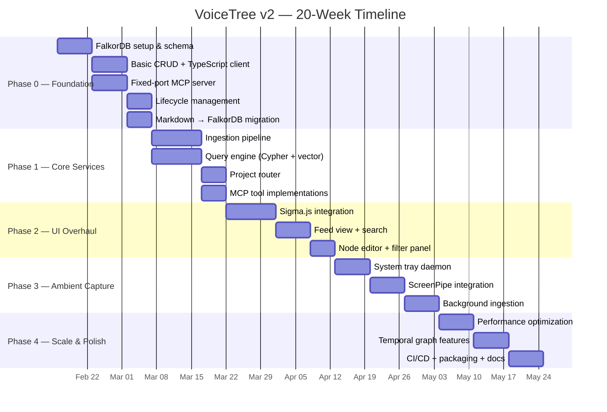
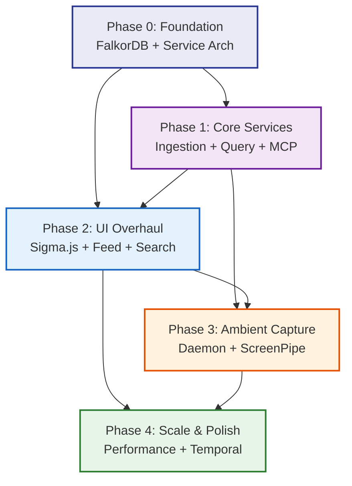

# VoiceTree v2 — Implementation Plan

> **Status**: Planning  
> **v1 tag**: `v1.0.0-final`  
> **Target**: 20-week phased delivery  
> **Primary DB**: FalkorDB (graph + vector)  
> **Runtime**: Electron (with proper service architecture)

---

## Overview

VoiceTree v2 is a ground-up rewrite of the data layer, service architecture, and rendering pipeline while preserving the core value proposition: **voice/text → structured graph knowledge + multi-agent MCP orchestration**.

### What Changes

| Concern | v1 | v2 |
|---------|----|----|
| Data store | Markdown files + ChromaDB cache | **FalkorDB** (graph + vector in one) |
| Graph rendering | Cytoscape.js (300-node cap) | **Sigma.js** (10k+ nodes, WebGL) |
| Service model | Electron app watching one folder | **Persistent service** with daemon mode |
| MCP discovery | Per-project config injection | **Fixed port + one-time `voicetree setup`** |
| Project support | Single folder | **Multi-project routing** |
| Lifecycle | No shutdown, port leaks | **Graceful startup/shutdown** |
| Ambient capture | None | **ScreenPipe integration** |
| Vector search | ChromaDB (Python sidecar) | **FalkorDB vector indexes** (eliminates ChromaDB) |

### What Stays

- Electron runtime (team knows it, faster iteration than Tauri rewrite)
- React + Tailwind UI
- MCP tool API design (`create_graph`, `spawn_agent`, `wait_for_agents`)
- Voice → structured nodes pipeline (concept)
- Agent progress tracking on live graph
- Pure/shell architecture split
- Git worktree management for agents

---

## Phase Overview

---

## Phase Documents

| Phase | Document | Duration | Focus |
|-------|----------|----------|-------|
| 0 | [PHASE-0-FOUNDATION.md](PHASE-0-FOUNDATION.md) | Weeks 1–4 | FalkorDB + service architecture + lifecycle |
| 1 | [PHASE-1-CORE-SERVICES.md](PHASE-1-CORE-SERVICES.md) | Weeks 5–8 | Ingestion, query engine, project router, MCP tools |
| 2 | [PHASE-2-UI-OVERHAUL.md](PHASE-2-UI-OVERHAUL.md) | Weeks 9–12 | Sigma.js, feed view, search, filters |
| 3 | [PHASE-3-AMBIENT-CAPTURE.md](PHASE-3-AMBIENT-CAPTURE.md) | Weeks 13–16 | Daemon mode, ScreenPipe, background ingestion |
| 4 | [PHASE-4-SCALE-AND-POLISH.md](PHASE-4-SCALE-AND-POLISH.md) | Weeks 17–20 | Performance, temporal graph, CI/CD, docs |

---

## Dependencies Between Phases

**Critical path**: Phase 0 → Phase 1 → Phase 2. Phases 3 and 4 can partially overlap with earlier phases but have hard dependencies on the query engine and UI being functional.

---

## Risk Assessment

| Risk | Impact | Likelihood | Mitigation |
|------|--------|------------|------------|
| FalkorDB Docker overhead on desktop | High | Medium | Profile cold-start. Fallback: Redis embedded module on macOS/Linux, Docker on Windows |
| FalkorDB vector search maturity | High | Low | FalkorDB has production vector support. Fallback: keep ChromaDB for vectors only |
| Sigma.js migration complexity | Medium | Medium | Run Sigma.js and Cytoscape.js in parallel during transition |
| ScreenPipe availability | Low | Medium | ScreenPipe is optional; ingestion pipeline works without it |
| Multi-project routing complexity | Medium | Medium | Start with single-project, add routing incrementally |
| 20-week timeline slippage | High | High | Phases are designed to be independently shippable. Phase 0+1 = minimum viable v2 |
| Team Rust learning curve (Tauri) | Eliminated | N/A | Decision: stay with Electron |

---

## Success Criteria

### Phase 0 Complete
- [ ] FalkorDB running in Docker, managed by Electron lifecycle
- [ ] Cypher schema deployed with nodes, edges, tags, versions
- [ ] Existing markdown vault importable via migration tool
- [ ] MCP server on fixed port, discoverable by any client
- [ ] Clean startup and shutdown (no port leaks, no orphan containers)

### Phase 1 Complete
- [ ] Voice/text/agent input flows through unified ingestion pipeline into FalkorDB
- [ ] Cypher + vector + BM25 blended query returns ranked results
- [ ] All v1 MCP tools work against FalkorDB backend
- [ ] Multi-project routing functional

### Phase 2 Complete
- [ ] Sigma.js renders 5,000+ nodes at 60fps
- [ ] Feed view provides chronological/relevance navigation
- [ ] Full-text + semantic + graph-aware search works
- [ ] Filter panel operational (type, tag, relation, time)

### Phase 3 Complete
- [ ] VoiceTree runs as system tray daemon
- [ ] Auto-starts on login
- [ ] ScreenPipe events ingested and tagged
- [ ] Background ingestion doesn't degrade UI performance

### Phase 4 Complete
- [ ] 10,000+ node graphs render without degradation
- [ ] Temporal graph queries work (history, diffs, time-sliced views)
- [ ] Automated CI/CD pipeline with cross-platform builds
- [ ] User documentation published

---

## Key Architectural Decisions

1. **FalkorDB over Kuzu** — FalkorDB provides graph + vector in one store, eliminating ChromaDB. Redis-backed performance is excellent. Docker deployment is well-understood. Trade-off: requires Docker runtime, but this is acceptable for a desktop app that already manages subprocesses.

2. **Electron over Tauri** — The team knows Electron. Tauri would add 2-3 months of learning curve for marginal memory savings. The real improvements come from fixing the service architecture, not changing the runtime.

3. **Sigma.js over Cytoscape.js** — Purpose-built for large graphs with WebGL rendering. 10k+ nodes at 60fps vs Cytoscape's struggle at 300. The API is different but the migration is bounded.

4. **FalkorDB for vectors** — FalkorDB supports vector similarity search natively, meaning we can eliminate ChromaDB entirely. One data store for everything: graph traversal, vector search, full-text search.

5. **Docker-managed FalkorDB** — Electron spawns and manages a Docker container for FalkorDB. This is the same pattern used by many desktop apps (e.g., Docker Desktop itself, various database GUIs). Users need Docker installed, but this is reasonable for a developer-focused tool.

---

## Reference

- [NORTH-STAR.md](../NORTH-STAR.md) — Vision and strategic decisions
- [ARCHITECTURE.md](../ARCHITECTURE.md) — Technical architecture detail
- [COMPETITIVE-LANDSCAPE.md](../COMPETITIVE-LANDSCAPE.md) — Market research
- [TODO.md](../TODO.md) — v1 roadmap (superseded by this plan)
